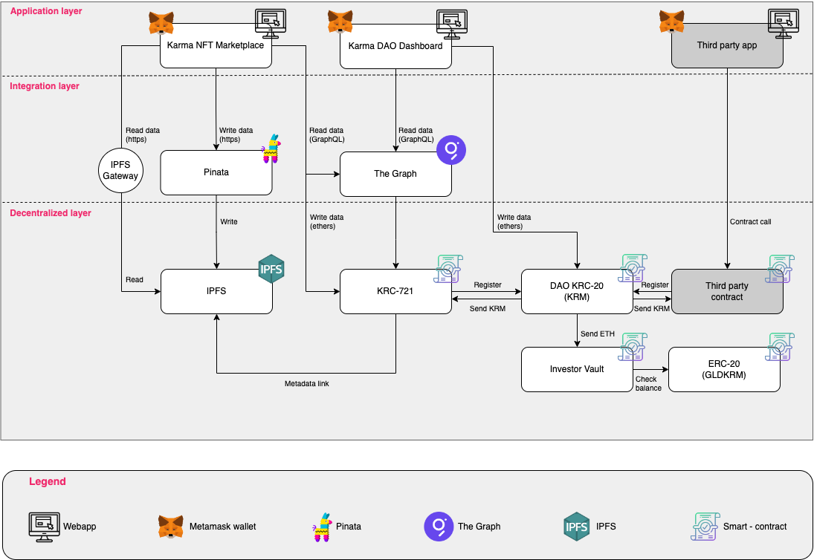
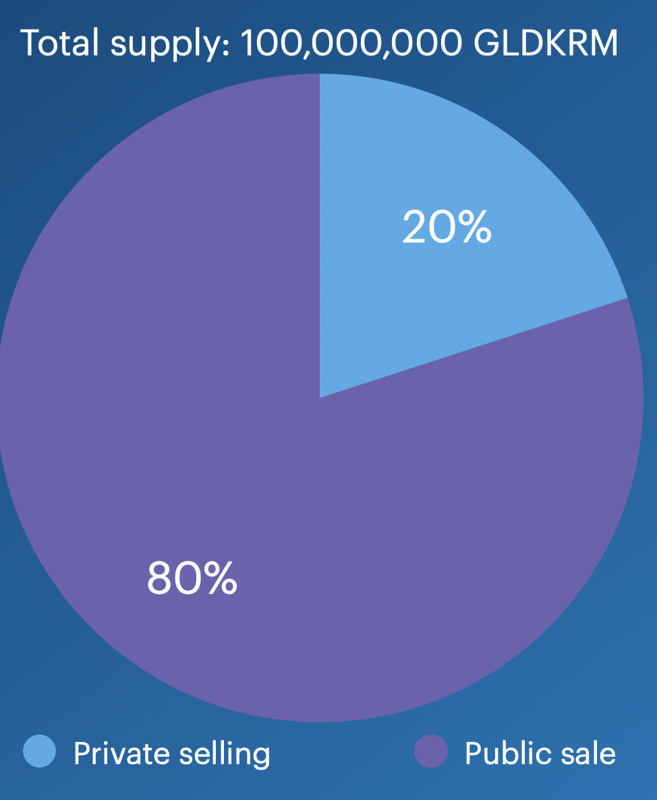
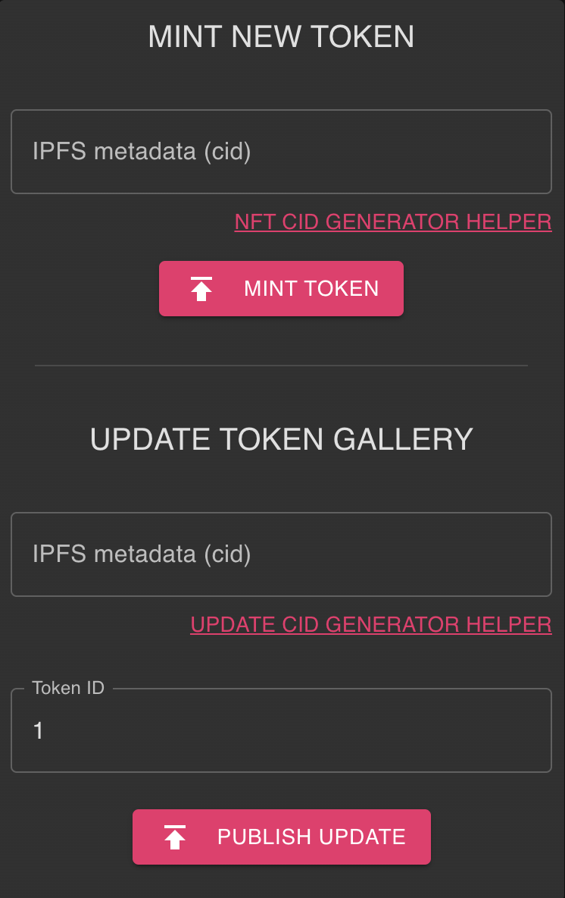
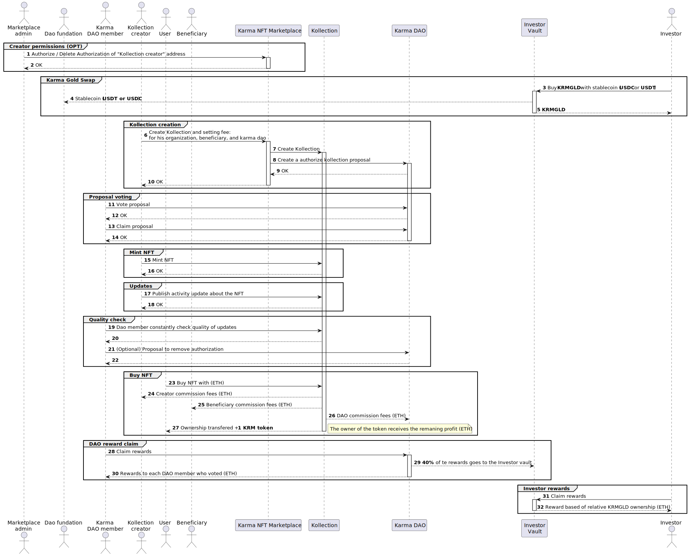

# Karma: A Decentralized DAO Promoting Good Deeds
"Good Karma," a concept rooted in ancient wisdom, is often understood as the positive spiritual merit earned through kind deeds, compassion, and altruistic actions. It is the belief that benevolent acts create a positive force that returns to us, fostering a cycle of goodwill and positive energy. Leveraging this philosophical cornerstone, Karma Protocol seeks to manifest the essence of "good karma" in our digital age.

In the present world, an individual's perceived worth often hinges on wealth, social status, and digital popularity. This paradigm tends to perpetuate materialism over altruism and benevolence, creating societal structures that favor personal gain over communal prosperity. Recognizing this imbalance, Karma Protocol proposes a paradigm shift, envisaging a world where individuals earn recognition and value based on their kind deeds and societal contributions.

Karma Protocol is pioneering a future where altruism is incentivized. Through a blockchain-based system, we encourage good deeds by rewarding them with Karma tokens. On our platform, the Karma Marketplace, users can donate goods and services, earning Karma tokens in return. A percentage of these transactions directly benefit charitable organizations, forging a cycle of giving that rewards both the giver and the broader community.

By converting good deeds into a quantifiable and tangible form, the Karma Protocol promotes a societal transition towards kindness, compassion, and social responsibility. It encourages individuals to contribute to the betterment of society, fostering a community where goodwill and shared prosperity are valued above personal gain.
In a revolutionary stride, Karma Protocol seeks to intertwine its system with social media platforms. Users are motivated to perform more good deeds, while simultaneously contributing to the betterment of the real-world community.

Karma Protocol is more than just a blockchain system - it represents a movement towards recognizing individuals for their societal contributions over their material possessions or social status. By incentivizing benevolent deeds and encouraging social responsibility, the Karma Protocol aspires to inspire a global transition towards a more compassionate, equitable society.

The Karma Protocol operates through a Decentralized Autonomous Organization (DAO) and smart contracts. These can subscribe to the DAO for certification and permission to distribute rewards in KRM tokens. KChain Solution supports the DAO with a decentralized NFT marketplace, where Donors can publish their unique Kollection of NFTs that represent Art/Skill, Time, or fundraising for charitable activities. Donors must update their NFTs to transparently demonstrate how user funds are utilized, with each Kollection verified and certified by DAO members to ensure adherence to promised standards.

Leveraging blockchain technology, Karma Protocol utilizes tokenization to actualize its vision. The ERC-20 standard has been expanded to implement the DAO, and the ERC-721 standard has been adapted to enable NFTs that can track updates from creators and manage sales commission distribution in a unique manner, as it will be shown in the Tokenomics paragraph.

# High Level Design
Let's delve into the architectural structure of the system, which is strategically distributed across three primary layers:

**Application Layer:** The application layer primarily consists of frontend components. This frontend application, developed in ReactJS, utilizes decentralized technologies, thereby ensuring no personal data is stored in its sessions. Interaction with the underlying data is seamlessly facilitated via the MetaMask wallet, safeguarding user privacy and security.

**Integration Layer:** The integration layer serves as a pivotal intermediary bridge, designed to streamline the interaction with the underlying layer. This includes tools such as Pinata, an IPFS provider chosen to ease the management of metadata not stored directly on-chain. Given that on-chain data storage can be costly and resource-intensive, storing data on IPFS and linking the IPFS reference on the smart contract (ERC-721) is a more economical and efficient solution. This design also gives expert Donors the flexibility to manage their data directly on their IPFS node.
The Graph is another key component of this layer, a protocol specifically developed to simplify the process of reading on-chain data. The integration with The Graph allows the application layer to execute complex queries with minimal latency, ensuring efficient response times.

**Decentralized Layer:** The decentralized layer stands as the backbone of the Karma protocol. All business logic is verified and overseen by smart contracts, encompassing:

* DAO KRC20: This manages the DAO, the respective voting mechanics and KRM minting policies.
* Investor Vault: This governs the sale of GLDKRM tokens and the distribution of dividends.
* KRC-721: This represents the NFT collections (extension of ERC-721).

Moreover, this layer provides third-party contracts with the opportunity to register with the DAO for certification, thereby enabling them to earn rewards in the form of KRM tokens. 

# Tokenomics
Before delving into the technicalities, it is crucial to understand the fundamental concept driving the tokenomics of the Karma Protocol. This involves an exploration of the various participants within the protocol, their unique roles, and the incentivization mechanisms designed to stimulate their active participation.

The Karma Protocol's tokenomics is a complex yet balanced ecosystem designed to incentivize participation from all its members. It reflects our commitment to fostering a community where altruism and social responsibility are not just valued but rewarded.

## Participants
* **Donor:** the Donor is an integral part of the Karma Marketplace. They are enabled to offer their Art/Skill and Time, represented as Non-Fungible Tokens (NFTs) based on the KRC-721 standard. Donors are not just sellers but also active contributors to the protocol. They can publish updates related to their service directly on the NFT, demonstrating their ongoing commitment and transparency.

* **Beneficiary:** When creating an NFT Kollection, the Donor has the option to specify a Beneficiary. This Beneficiary is set to receive royalties from each transaction involving the Donor's NFTs. For instance, an artist Donor can pledge a portion of their sales proceeds to a charitable initiative, creating a tangible social impact.

* **Kollector:** A Kollector acts as a buyer and potential reseller of the KRC-721 NFTs. Each purchase transaction triggers the creation of Karma tokens, which are then transferred to both the buyer and the seller, thus rewarding active marketplace participation.

* **Investor:** Investors in the Karma Protocol are holders of the Gold Karma (GLDKRM) token. This token represents an investment into the future of the platform and confers the right to access 40% of the DAO donations, derived from donations to the DAO.

* **DAO Member:** A DAO Member is a certified participant with voting rights within the DAO. They play an active role in authorizing contracts, approving new DAO members, and setting DAO parameters. Their participation is incentivized through a share of the 60% of donations made to the DAO, further encouraging active, invested governance.

## Karma Token (KRM) and DAO
The Karma Token (KRM) is a unique extension of the ERC-20 standard token, termed as KRC-20. Unlike typical tokens, KRM begins with an initial supply of zero and gradually increases in circulation as individuals perform good deeds within the Karma Protocol ecosystem. This feature of KRM is designed to mirror the concept of Karma - every positive action in society generates new Karma, that has an infinite supply. Underpinning KRM is the concept of Proof-of-Karma (PoK), an innovative protocol that quantifies an individual's contributions towards societal welfare.

Fundamentally, the philosophy underpinning Karma is the notion that it should be earned through genuine, selfless contributions, and not easily transferable or monetized. Reflecting this, the KRM token has an 80% burn rate on transfer, a parameter set and governed by the DAO. This high burn rate underscores the significance of owning Karma, demonstrating its value as a marker of benevolent contribution rather than a tradable asset.

Looking ahead, initiatives will be planned exclusively for KRM owners, based on their staked holdings, further enhancing the benefits of active participation in the Karma ecosystem.

KRM, therefore, serves as a symbol of status, representing one's altruistic actions more than their monetary value.

But the KRC-20's utility extends beyond just minting and transferring KRM. It's also pivotal in managing DAO proposals.
The fundamental concept of a DAO is that its members can submit proposals for consideration. These proposals typically encompass the following functions:

* Adding a new member to the organization 
* Removing an existing member from the organization 
* Certifying a contract 
* Revoking a contract 
* Altering the minting threshold. This determines the minimum value a contract must generate to mint a KRM token. 
* Modifying the burning rate on a KRM transfer.

Once a proposal is submitted, all DAO members have the opportunity to vote on it. A proposal is considered accepted when it receives a positive vote from 51% of eligible members or when a pre-established vote threshold of eligible members is surpassed and the deadline expires. It's important to note that each DAO member is entitled to submit only one vote per proposal.

To maintain the utmost integrity and security within the DAO, membership is granted only through an official proposal, followed by a rigorous screening process prior to voting. This measure ensures that only serious and committed individuals gain membership, thus fostering a more robust and trusted DAO environment. Additionally, a member is incentivized to vote coherently, aligning with the greater DAO objectives, in order to receive incentives deriving from the protocol's adoption. This serves as a motivational tool to encourage active and thoughtful participation, further contributing to the growth and success of the DAO.

From this, we can appreciate the power embedded in the DAO's ability to certify a contract. When a Kollector opts to interact with a DAO-certified smart contract, they have the assurance that DAO members have scrutinized and approved the Donor Kollection or a third-party contract. In this way, the Karma Protocol combines decentralized trust, participation-driven governance, and tokenized altruism into one robust ecosystem.

## GLDKRM
While KRM tokens represent social commitment, Golden Karma (GLDKRM) is a coin with a hard cap of 100,000,000. Its purpose is to incentivize investors to participate in the network and earn dividends. Holders of GLDKRM can collect dividends generated by the DAO in proportion to their holdings, stimulating active participation and support within the network.

From the contributions made to the DAO, a proportion of 60% is allocated as a reward to the voters, reinforcing their commitment to the network. The remaining 40% is distributed among GLDKRM token holders, further incentivizing token ownership.

Among the total tokens, 20% are earmarked for the DAO founders to address private needs and strategic initiatives. The rest, 80%, is made available for purchase from the designated smart contract. The revenue derived from this sale is deployed for network development and maintenance.

The exchange rate is set at 1 USDC for every 100 GLDKRM. This is with a goal to raise $800,000, a sum necessary to finance the development for production release, marketing activities, and management of various initiatives, laying a strong foundation for the Karma ecosystem's success.

# NFT Marketplace
One use case of integration with the DAO is the NFT marketplace ([try it]()) implemented by the KCHAIN Solutions.

A Kollection Creator can publish NFTs and Kollections on the marketplace, representing various initiatives such as remote adoption (e.g., stray animals in shelters), a time marketplace, a skill marketplace, and other projects that require funding.

For each NFT, the Kollection Creator can update the progress of their project by posting updates.

If a Kollection Creator requests certification from the DAO, the DAO oversees the quality of the services offered and has the authority to revoke minting or trading permissions for the NFTs. When a Kollection is certified by the Karma DAO, a KRM token is attached to each NFT transaction for the buyer and the seller.

Additionally, The buying and selling of NFTs generate four different types of fees:

* Seller's profit
* Commission to the Kollection Creator
* Royalties to any beneficiaries (optional)
* Donation to the Karma DAO to sustain the protocol's usage
  
Donations to the Karma DAO are then distributed between voting members (60%) and investors holding GLDKRM (40%). Investors receive dividends proportional to their GLDKRM balance.

The platform is designed to be fully decentralized, hence all the metadata describing the NFT are managed through [IPFS](https://ipfs.tech/).

An helper for data upload via [Pinata](https://www.pinata.cloud/) has been implemented.

Here is the sequence diagram of the use case implemented.

[1 – 2] The Marketplace administrator possesses the authority to either grant or rescind Kollection creation privileges to the Donor.

[3 - 5] Investors have the opportunity to acquire GLDKRM tokens in exchange for USDC via the Investor Vault contract. A total of 80,000,000 tokens, equating to 80% of the overall supply, are up for sale.

[6 - 10] The Donor is equipped to formulate new Kollections. During this process, they are required to determine their organization's royalties, identify the amount of donation to be disbursed to the Karma DAO, and decide if they wish to designate an additional beneficiary. Each new Kollection triggers the creation of a proposal, which is subject to the DAO members' approval.

[11 - 14] DAO members exercise their voting rights to endorse or reject the generated proposal. When the proposal garners enough positive votes to cross the minimum threshold, a claim can be initiated to record the approval. This approval activates the trade of NFTs produced by the Kollection.

[16 - 18] The Donor is at liberty to mint new NFTs or append updates pertinent to the NFT. An update typically comprises a textual description and an external link facilitating external visitors to browse related news about the NFT. These updates and the accompanying metadata are stored on IPFS. Users may opt to manage their IPFS node independently or utilize the Marketplace's guided procedure employing a Pinata account as the IPFS provider.

[19 – 22] DAO members maintain stringent vigilance over certified contracts, reserving the right to revoke certifications if non-compliance with community standards is observed.

[23 - 27] A Kollector can proceed to acquire an NFT, given its proprietor has listed it for sale. Upon the purchase, all due commissions are fairly disbursed among the rightful claimants.

[28 - 30] Once the minimum threshold is reached, DAO members can stake their claim to the rewards. As previously mentioned, 60% of the rewards are allocated to DAO members, while the remaining 40% is divided among the GLDKRM token holders.

# Conclusion
In conclusion, the Karma Protocol represents a significant breakthrough in the realm of blockchain and decentralized applications, integrating the concepts of altruism, rewards, and governance into a unique and efficient ecosystem.

The design and structure of this system, spanning across the Karma Token (KRM), Gold Karma Token (GLDKRM), and a decentralized autonomous organization (DAO), showcase the power of blockchain technology when applied to societal welfare and communal participation. The Karma Protocol's tokenomics, underpinned by the Proof-of-Karma (PoK) mechanism, encapsulates the spirit of earning rewards through genuine societal contributions, as seen through the innovative token burn rate and DAO governance model.

Our solution relies on the time-tested and secure EVM machine and leverages the Solidity programming language, allowing for the protocol to tap into a host of high-market-cap blockchains. Furthermore, the protocol's architectural layers ensure data decentralization, security, and scalability while keeping in mind transaction costs.

For the latest updates on Karma Protocol, please visit our website at [https://earnkarma.io](https://earnkarma.io). To try our application, head over to [https://app.earnkarma.io](https://app.earnkarma.io).
